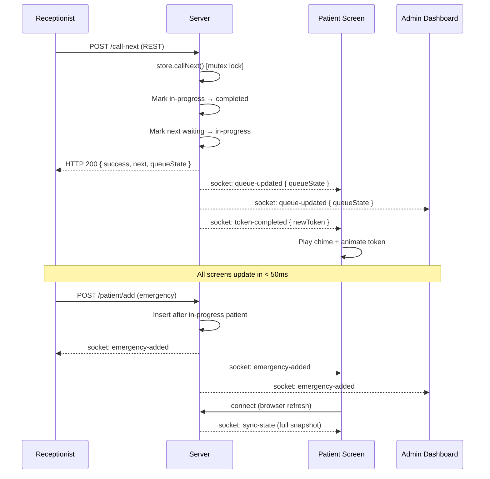

# 🏥 QueueCure'26

> **Real-time Clinic Queue Management System** — Replacing paper token slips in Indian clinics with a live digital queue.

[](https://reactjs.org)
[](https://socket.io)
[](LICENSE)

---

## 📋 Problem Statement

Indian clinics hand out paper token slips to patients.  
This causes:
- **No visibility** — patients don't know how long they'll wait
- **Chaos** when the doctor is unavailable
- **No priority system** for emergencies
- **Wasted receptionist time** re-announcing tokens manually

**QueueCure'26 solves all of this** with a real-time digital queue that runs on any device.

---

## ✨ Features

| Feature | Description |
|---------|-------------|
| 🔴 **Real-time sync** | Socket.io pushes every change to all screens instantly — no refresh |
| 🚨 **Emergency priority** | Emergency patients jump to the front of the queue automatically |
| ⏱ **Dynamic wait time** | `tokensAhead × avgConsultationTime` — receptionist-adjustable |
| 📢 **Live announcements** | Patient screen shows animated "Now Serving / Next" with sound |
| ⏸ **Pause / Resume** | Doctor steps away → all screens show "Unavailable" instantly |
| 🔍 **Token lookup** | Patients type their token → see position + wait time + progress bar |
| 🔐 **JWT Auth** | Receptionist & Admin roles, session persists across browser refresh |
| 🌙 **Dark mode** | System-preference aware, toggleable |
| 🔔 **Sound notifications** | Web Audio API chime when token changes (no external library) |
| 📱 **Fully responsive** | Works on TV display, desktop, tablet, and phone |
| 📊 **Admin analytics** | Doctor-wise breakdown, efficiency %, peak queue, served count |

---

## 🛠 Tech Stack

### Backend
| Layer | Technology |
|-------|-----------|
| Runtime | Node.js 18+ |
| Framework | Express.js |
| Real-time | Socket.io 4.x |
| Auth | JWT (jsonwebtoken) |
| Storage | In-memory (MongoDB-ready) |
| Architecture | MVC + REST + WebSocket |

### Frontend
| Layer | Technology |
|-------|-----------|
| Framework | React 18 + Vite |
| Styling | TailwindCSS 3 |
| Routing | React Router v6 |
| State | Context API |
| Real-time | Socket.io-client |
| Fonts | Inter (Google Fonts) |

---

## 🚀 Quick Start

### Prerequisites
- Node.js 18+
- npm 9+

### 1. Clone & Install

```bash
git clone https://github.com/yourusername/queuecure26.git
cd queuecure26

# Backend
cd backend
cp .env.example .env
npm install

# Frontend
cd ../frontend
cp .env.example .env
npm install
```

### 2. Run (two terminals)

```bash
# Terminal 1 — Backend
cd backend
npm run dev
# Server starts at http://localhost:4000

# Terminal 2 — Frontend
cd frontend
npm run dev
# UI starts at http://localhost:5173
```

### 3. Login

| Role | Email | Password |
|------|-------|----------|
| Receptionist | reception@queuecure.com | 123456 |
| Admin | admin@queuecure.com | 123456 |

Patient Waiting Room (no login): `http://localhost:5173/patient`

---

## 📁 Folder Structure

```
queuecure26/
├── backend/
│   ├── server.js                  # Express + Socket.io entry point
│   ├── package.json
│   ├── .env.example
│   ├── controllers/
│   │   ├── authController.js      # JWT login / verify
│   │   └── queueController.js     # All queue REST operations
│   ├── middleware/
│   │   └── authMiddleware.js      # JWT verify + role guard
│   ├── models/
│   │   └── inMemoryStore.js       # In-memory store (MongoDB-ready)
│   ├── routes/
│   │   ├── authRoutes.js
│   │   └── queueRoutes.js
│   └── socket/
│       └── socketHandler.js       # All Socket.io events
│
└── frontend/
    ├── index.html
    ├── vite.config.js
    ├── tailwind.config.js
    ├── package.json
    ├── .env.example
    └── src/
        ├── App.jsx                # Root router
        ├── main.jsx
        ├── index.css              # Tailwind + custom utilities
        ├── socket/
        │   └── socket.js          # Singleton socket client
        ├── context/
        │   ├── AuthContext.jsx    # JWT auth + localStorage persist
        │   └── QueueContext.jsx   # Queue state + socket integration
        ├── hooks/
        │   ├── useToast.js
        │   └── useDarkMode.js
        ├── components/
        │   ├── Navbar.jsx
        │   ├── Toast.jsx          # Toast notification system
        │   ├── ProtectedRoute.jsx
        │   ├── Clock.jsx
        │   ├── StatsCards.jsx     # 4 live metric cards
        │   ├── QueueTable.jsx     # Searchable / paginated table
        │   ├── AddPatientModal.jsx
        │   ├── EditPatientModal.jsx
        │   └── LiveAnnouncement.jsx # Animated token display + sound
        └── pages/
            ├── Login.jsx
            ├── ReceptionDashboard.jsx
            ├── PatientWaitingRoom.jsx
            ├── AdminDashboard.jsx
            └── NotFound.jsx
```

---

## 📡 Socket Events

```
CLIENT → SERVER                SERVER → ALL CLIENTS
─────────────────────          ──────────────────────────────
identify          →            sync-state       (on connect/reconnect)
request-sync      →            queue-updated    (any mutation)
call-next (sock)  →            patient-added
ping-check        →            emergency-added
                               queue-paused
                               queue-resumed
                               average-time-changed
                               token-completed  (triggers sound + animation)
                               pong-check
```

### Mermaid Flow Diagram



---

## 🌐 API Endpoints

### Auth
| Method | Path | Auth | Description |
|--------|------|------|-------------|
| POST | `/api/auth/login` | ❌ | Login, returns JWT |
| GET | `/api/auth/verify` | ✅ | Verify token |

### Queue
| Method | Path | Auth | Description |
|--------|------|------|-------------|
| GET | `/api/queue` | ❌ | Full queue state |
| GET | `/api/current-token` | ❌ | Currently serving token |
| GET | `/api/patient/wait/:token` | ❌ | Patient wait info |
| GET | `/api/stats` | ✅ | Queue analytics |
| POST | `/api/patient/add` | ✅ | Add patient to queue |
| POST | `/api/call-next` | ✅ | Advance queue |
| POST | `/api/pause` | ✅ | Pause queue |
| POST | `/api/resume` | ✅ | Resume queue |
| POST | `/api/avg-time` | ✅ | Set avg consultation time |
| PUT | `/api/patient/:id` | ✅ | Update patient details |
| DELETE | `/api/patient/:id` | ✅ | Remove patient |

---

## 🚢 Deployment

### Backend → Render

1. Push `backend/` folder to GitHub
2. New Web Service on [render.com](https://render.com)
3. Settings:
   - **Build command:** `npm install`
   - **Start command:** `node server.js`
4. Environment Variables:
   ```
   PORT=4000
   JWT_SECRET=your-secret-here
   ALLOWED_ORIGINS=https://your-frontend.vercel.app
   ```

### Frontend → Vercel

1. Push `frontend/` folder to GitHub
2. Import project on [vercel.com](https://vercel.com)
3. Framework preset: **Vite**
4. Environment Variables:
   ```
   VITE_API_URL=https://queuecure-backend.onrender.com/api
   VITE_SOCKET_URL=https://queuecure-backend.onrender.com
   ```

---

## 🧠 Thought Process

### Why Socket.io?
REST polling every 2 seconds would work but creates unnecessary load and has 2s latency. Socket.io maintains a persistent WebSocket connection, pushing updates to all clients in **< 50ms**. When a receptionist clicks "Call Next", every patient screen in the waiting room updates instantly — critical for a real clinic.

### How wait time is calculated?
```
estimatedWait = tokensAhead × avgConsultationTime
```
`tokensAhead` is the count of "waiting" patients before this patient in the sorted queue. `avgConsultationTime` is set by the receptionist (2/5/10/15 min) based on the doctor's actual pace. This is **never hardcoded** — it adjusts in real time when the receptionist changes it.

### How concurrency is handled?
The `callNext()` function in `inMemoryStore.js` uses a **mutex flag** (`isCallNextLocked`) that blocks concurrent calls for 500ms. This prevents:
- Double-click from one receptionist
- Two receptionists clicking simultaneously from different tabs
- Socket + REST both triggering at the same millisecond

### How race conditions are avoided?
1. **Server-side mutex** — only one `callNext()` executes at a time
2. **Client-side debounce** — QueueContext ignores calls within 800ms
3. **Full state snapshots** — every socket event carries the complete `queueState`, so clients can't drift out of sync from missed events
4. **Sequential token generation** — tokens are generated server-side with an integer counter, impossible to duplicate

### How emergency patients are prioritized?
When `priority === 'emergency'`, `addPatient()` finds the current `in-progress` patient's index and inserts the emergency patient immediately after. So on the very next "Call Next" click, the emergency patient is served. This is handled atomically on the server — no client-side sorting tricks.

### How browser refresh persistence works?
- **Auth**: JWT token + user object stored in `localStorage` → `AuthContext` reads on mount
- **Queue state**: On socket `connect` event, server immediately emits `sync-state` with the full queue snapshot → `QueueContext` applies it
- No data is lost; the patient waiting room re-renders with the correct state within one round-trip

### How to scale with Redis + MongoDB later?
1. **MongoDB**: Replace `inMemoryStore.js` functions with Mongoose model calls — all controller/socket signatures remain unchanged
2. **Redis Pub/Sub**: Run multiple Node.js instances behind a load balancer, use `socket.io-redis` adapter so Socket.io events are broadcast across all instances
3. **Sticky sessions** or WebSocket upgrade at the load balancer ensures Socket.io connections work in a cluster

---

## 📸 Screenshots

| Screen | Description |
|--------|-------------|
| Login | Split hero + form layout, quick demo buttons |
| Reception Dashboard | Action bar, 4 live stat cards, searchable queue table |
| Patient Waiting Room | Large animated token display, token lookup, progress bar |
| Admin Dashboard | Efficiency metrics, doctor breakdown, system status |

---

## 🔮 Future Improvements

- [ ] MongoDB persistence + multi-day history
- [ ] SMS/WhatsApp notification when patient's turn is near
- [ ] Multiple queues per doctor
- [ ] Appointment booking (future timeslots)
- [ ] Redis adapter for horizontal scaling
- [ ] PWA — installable on phone home screen
- [ ] Print token QR code
- [ ] Analytics with Chart.js / Recharts
- [ ] Multi-clinic / multi-branch support

---

## 📄 License

MIT © 2026 QueueCure Team
